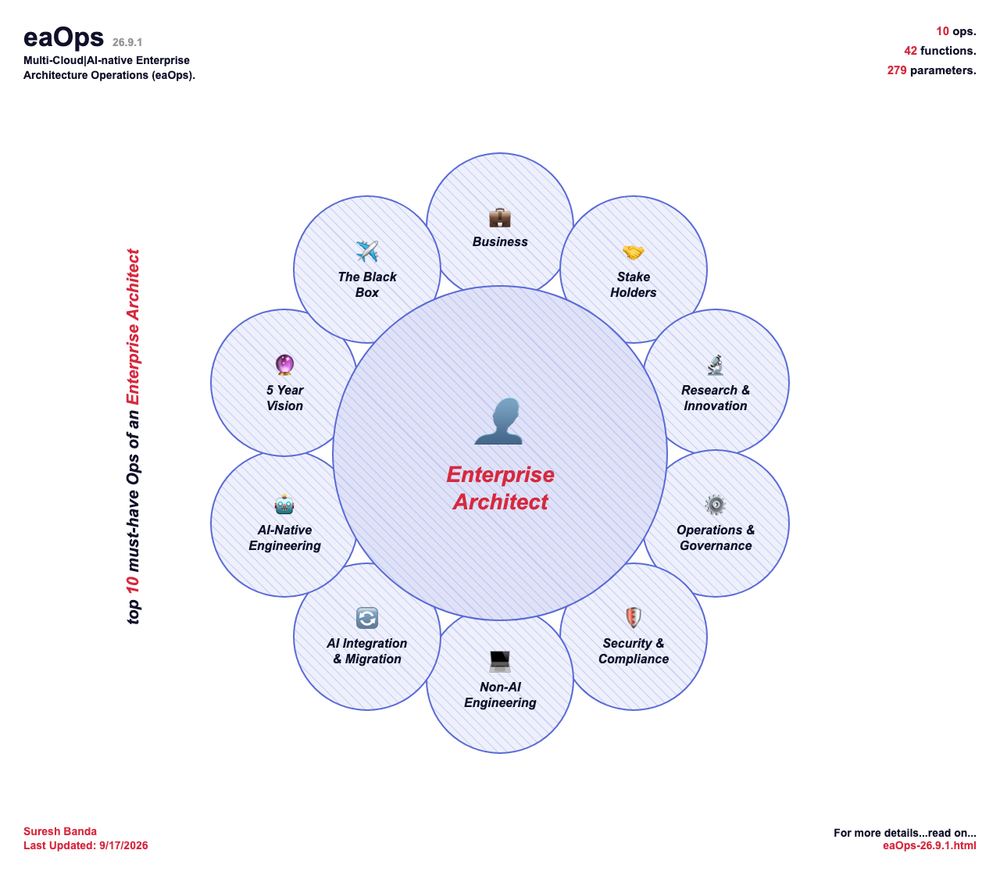

# eaOps

**Multi-Cloud | AI-native Enterprise Architecture Operations** — version 26.9.1

eaOps is a reference checklist of the capabilities an enterprise architect needs to plan for, for both product delivery and service engagements. Every item is grounded in a single hypothetical use case, **Customer, Products & Orders (CPO)**, so each one has a concrete example behind it instead of staying abstract.



## Structure

eaOps is organised as **10 Ops**, broken into **42 Functions**, broken into **279 Parameters**. Every Parameter carries four parallel descriptions (Azure, GCP, AWS and open-source), so no capability is tied to one vendor.

| # | Op | Functions |
|---|----|-----------|
| 1 | Business | 2 |
| 2 | Stake Holders | 3 |
| 3 | Research & Innovation | 1 |
| 4 | Operations & Governance | 4 |
| 5 | Security & Compliance | 6 |
| 6 | Non-AI Engineering | 12 |
| 7 | AI Integration & Migration | 3 |
| 8 | AI-Native Engineering | 7 |
| 9 | 5 Year Vision | 2 |
| 10 | The Black Box | 2 |

Items are numbered hierarchically (Op → Function → Parameter, e.g. `8.7` or `9.2.2`) and cross-reference each other by number.

## Contents

| File | Description |
|------|-------------|
| [dist/eaOps.html](dist/eaOps.html) | The full eaOps document: a single self-contained page with a table of contents and collapsible Ops, Functions and Parameters. Always the latest build |
| [dist/eaOps.png](dist/eaOps.png) | Block diagram of the 10 Ops around the Enterprise Architect, embedded in the HTML |
| [content/](content/) | The source: one YAML file per Op |
| [tools/](tools/) | `build_html.py` generates the page from `content/` using `template.html`, and `build_block_diagram.py` draws the diagram |
| [VERSION](VERSION) | The current version |
| [LICENSE](LICENSE) | MIT License, covering code |
| [LICENSE-CONTENT](LICENSE-CONTENT) | CC BY 4.0, covering the eaOps content |

Each release is tagged in git as `vYY.M.patch` (for example `v26.9.1`), and `dist/` always holds the latest build.

## Usage

Open `dist/eaOps.html` in a browser. It has no dependencies, but keep the PNG in the same folder so the block diagram displays.

To print or export to PDF with every section expanded, open the page with `?print=1` appended to the URL, then print from the browser.

## Building from source

Two scripts in [tools/](tools/) generate the deliverables from [content/](content/) and [VERSION](VERSION). Both need Python 3.

| Script | Writes | Also needs |
|--------|--------|------------|
| [build_html.py](tools/build_html.py) | `dist/eaOps.html`, numbering everything from file order and position | PyYAML |
| [build_block_diagram.py](tools/build_block_diagram.py) | `dist/eaOps.png`, with the Op, function and parameter counts read from `content/` | Pillow and a colour-emoji font (Apple Color Emoji on macOS, Noto Color Emoji on Linux) |

### Setup, validate and preview

You need Python 3 and `make`, which macOS and Linux have (on Windows, use WSL). Nothing else is needed: the first `make` command creates a `.venv` folder and installs the requirements by itself.

```
make check        # validate content/*.yaml; prints the Op/Function/Parameter counts
make preview      # build preview/eaOps.html and preview/eaOps.png; dist/ is not touched
```

Then open `preview/eaOps.html` in a browser. `make help` lists the targets, and `make clean` deletes `preview/`.

Without `make`, do the same by hand. A virtual environment avoids the "externally-managed-environment" error that `pip` gives on some system Pythons:

```
python3 -m venv .venv
source .venv/bin/activate         # repeat in each new terminal
pip install -r tools/requirements.txt
python tools/build_html.py --check
mkdir -p /tmp/preview
python tools/build_block_diagram.py --out /tmp/preview/eaOps.png
python tools/build_html.py --out /tmp/preview/eaOps.html
open /tmp/preview/eaOps.html            # macOS; use xdg-open on Linux
```

Keep the PNG beside the HTML, or the block diagram won't show.

### Release (maintainers)

`main` is protected, so a release goes through a pull request like any other change, and the tag comes last.

1. Start a release branch from an up-to-date `main`:
   ```
   git checkout main && git pull
   git checkout -b release/26.9.2
   ```
2. Change the number in `VERSION`, for example to `26.9.2`.
3. `python tools/build_html.py --updated 9/19/2026` writes `dist/eaOps.html`.
4. `python tools/build_block_diagram.py --updated 9/19/2026 --force` redraws `dist/eaOps.png`.
5. In `CHANGELOG.md`, move the `[Unreleased]` entries under a new `[26.9.2]` heading with the date.
6. Commit `VERSION`, `dist/` and `CHANGELOG.md`, push the branch, open a pull request, and squash-merge it.
7. Tag the merged `main`, not the release branch. Squash-merging creates a new commit, so a tag made on the branch would point at a commit that never lands on `main`:
   ```
   git checkout main && git pull
   git tag v26.9.2
   git push origin v26.9.2
   ```
   Optionally create a GitHub Release from that tag, using the CHANGELOG entry as the notes.

Both scripts protect the current `dist/` files. `build_html.py` refuses to overwrite a page that already has the version in `VERSION`, and `build_block_diagram.py` refuses to overwrite an existing PNG unless you pass `--force`. To build without overwriting anything in `dist/`, point `--out` somewhere else.

### Options

| Option | Script | What it does |
|--------|--------|--------------|
| `--out FILE` | both | Write to `FILE` instead of the default (`dist/eaOps.html` or `dist/eaOps.png`). Missing folders are created |
| `--updated DATE` | both | The "Last Updated" date shown on the page or diagram, for example `9/17/2026`. Default: today |
| `--force` | both | Overwrite the output anyway. Needed for an existing PNG, or an HTML page that already has the current version |
| `--check` | `build_html.py` | Validate `content/` and exit without writing anything |
| `--content DIR` | `build_html.py` | Read the YAML from `DIR` instead of `content/` |
| `--template FILE` | `build_html.py` | Use a different page template than `tools/template.html` |
| `--scale N` | `build_block_diagram.py` | Output size multiplier. `2` gives a sharper 2560×2240 image. Default: 1 |
| `--author NAME` | `build_block_diagram.py` | The name in the diagram footer. Default: Suresh Banda |

## Contributing

Suggestions, corrections and vendor-specific improvements are welcome. Please read [CONTRIBUTING.md](CONTRIBUTING.md) and open an issue using one of the templates. Participation is governed by the [Code of Conduct](CODE_OF_CONDUCT.md). Release history is in [CHANGELOG.md](CHANGELOG.md).

## Disclaimer

This document is provided for educational and informational purposes only. It is a reference checklist illustrating enterprise architecture concepts using a hypothetical CPO use case. It is not intended for dev/qa/staging/production use, as professional or legal advice, or as a substitute for independent architectural, security or compliance review. No warranty, express or implied, is made as to its accuracy, completeness or suitability for any purpose. Use at your own risk.

## Author

Suresh Banda — last updated 9/17/2026

## License

Copyright (c) 2026 Suresh Banda. This repository is dual-licensed:

- **Content** (the eaOps checklist text, structure and block diagram) is licensed under [CC BY 4.0](LICENSE-CONTENT). You may share and adapt it, including commercially, as long as you give appropriate credit, link to the license, and indicate if you made changes.
- **Code** (scripts and the inline CSS/JS) is licensed under the [MIT License](LICENSE).

Azure, Google Cloud, AWS and other product names are trademarks of their respective owners. eaOps is not affiliated with or endorsed by them.
